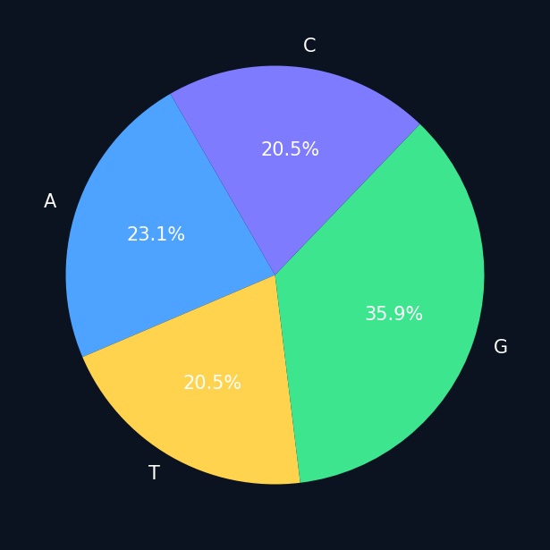

# BIOINFO

BIOINFO is a bioinformatics learning project that combines a Python backend, a KivyMD dashboard, and a Flutter frontend. It supports DNA and FASTA analysis, sequence utilities, local storage, and live NCBI lookups.

## What It Does

- DNA and FASTA analysis
- GC percentage calculation
- Reverse complement generation
- Protein translation
- Molecular weight estimation
- Nucleotide composition charting
- Local disease and gene search
- Live NCBI gene and protein details
- SQLite-backed search history
- Saved sequences and bookmarked genes
- KivyMD dashboard UI

## Project Structure

- `main.py` - main Python entry point
- `core/` - sequence analysis and API helpers
- `database/` - local storage and cached data
- `ui/` - KivyMD layout files
- `frontend_flutter/` - Flutter client project
- `assets/` - generated charts and images

## Screenshots

The current repository includes a visual preview of the nucleotide analysis output:



If you add more UI screenshots later, place them in an `assets/screenshots/` folder and link them here so the GitHub page shows the app more clearly.

## Getting Started

1. Install dependencies:

```powershell
pip install -r requirements.txt
```

2. Run the app:

```powershell
python main.py
```

## Notes

- The database and cache files in `database/` are part of the project state.
- Local environment files such as `.env` are intentionally ignored by Git.
- Flutter build outputs and Python cache files are excluded through `.gitignore`.

## GitHub Project Sync

This repository is configured with a workflow that can add new issues and pull requests to [Project 1](https://github.com/users/Xyz9934/projects/1).

To enable it, add a repository secret named `PROJECT_PAT` with a GitHub token that has access to Projects. Once that secret is present, new issues and pull requests will be added to the project automatically.
